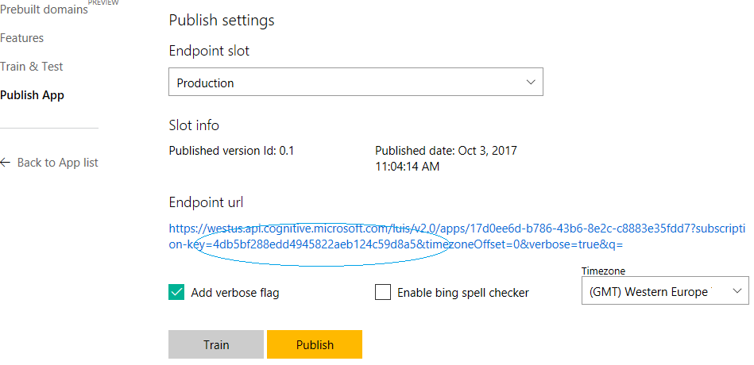
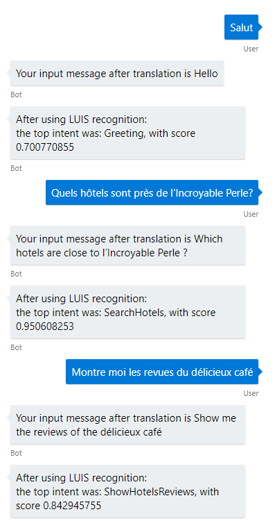

# LUIS Bot Sample

A sample bot using LuisDialog to integrate with a LUIS.ai application while using Translator Text API to support multiligual users.

[![Deploy to Azure][Deploy Button]][Deploy CSharp/LUIS]

[Deploy Button]: https://azuredeploy.net/deploybutton.png
[Deploy CSharp/LUIS]: https://azuredeploy.net

### Prerequisites

The minimum prerequisites to run this sample are:
* The latest update of Visual Studio 2015. You can download the community version [here](http://www.visualstudio.com) for free.
* The Bot Framework Emulator. To install the Bot Framework Emulator, download it from [here](https://emulator.botframework.com/). Please refer to [this documentation article](https://github.com/microsoft/botframework-emulator/wiki/Getting-Started) to know more about the Bot Framework Emulator.


#### LUIS Application

The first step to using LUIS is to create or import an application. Go to the home page, www.luis.ai, and log in. After creating your LUIS account you'll be able to Import an Existing Application where can you can select a local copy of the LuisBot.json file an import it.


If you want to test this sample, you have to import the pre-build [HotelReservation.json](Dialogs/HotelReservation/Resources/HotelReservation.json) file to your LUIS account.

Once you imported the application you'll need to "train" the model ([Training](https://docs.microsoft.com/en-us/azure/cognitive-services/luis/train-test)) before you can "Publish" the model in an HTTP endpoint. For more information, take a look at [Publishing a Model](https://docs.microsoft.com/en-us/azure/cognitive-services/luis/publishapp).

Finally, edit the [webconfig.cs](web.config) file and update the LuisModel attribute placeholders with the values corresponding to your Subscription and Application.


````XML
    ...
    <appSettings>
        <!-- update these with your BotId, Microsoft App Id and your Microsoft App Password-->
        <add key="LuisAppId" value="" />
        <add key="LuisSubscriptionKey" value="" />
    	<add key="TranslatorKey" value="" />
       ...
  </appSettings>
    ...
````

#### Where to find the Luis ID, Subscription Key and Translator Key

You'll need these two values to configure the LuisDialog through the LuisModel attribute:

1. Luis ID

    In the LUIS application's dashboard, you can copy the App ID from the address bar.
    
    
    
2. Subscription Key

    Click on the Publish App link from the LUIS application dashboard.  Once your app is published, copy the subscription key from the app endpoint url on the Publish App page.
    
    
    
3. Translator Key
    Get a key for Translator API from [here](https://azure.microsoft.com/en-us/services/cognitive-services/translator-text-api/)

### Outcome

You will see the following in the Bot Framework Emulator when opening and running the sample solution.



### More Information

To get more information about how to get started in Bot Builder for .NET and Conversations please review the following resources:
* [Bot Builder for .NET](https://docs.microsoft.com/en-us/bot-framework/dotnet/)
* [Add language understanding to a bot](https://docs.botframework.com/en-us/node/builder/guides/understanding-natural-language/)
* [LUIS Help Docs](https://docs.microsoft.com/en-us/azure/cognitive-services/LUIS/Home)
* [Cognitive Services Documentation](https://docs.microsoft.com/en-us/azure/#pivot=products&panel=cognitive)
* [Specify initial form state and entities](https://docs.microsoft.com/en-us/bot-framework/dotnet/bot-builder-dotnet-formflow-advanced#specify-initial-form-state-and-entities)
* [Translator Text API](https://azure.microsoft.com/en-us/services/cognitive-services/translator-text-api/)

> **Limitations**  
> The functionality provided by the Bot Framework Activity can be used across many channels. Moreover, some special channel features can be unleashed using the [ChannelData property](https://docs.microsoft.com/en-us/bot-framework/dotnet/bot-builder-dotnet-channeldata).
> 
> The Bot Framework does its best to support the reuse of your Bot in as many channels as you want. However, due to the very nature of some of these channels, some features are not fully portable.
> 
> The features used in this sample are fully supported in the following channels:
> - Skype
> - Facebook
> - Microsoft Teams
> - DirectLine
> - WebChat
> - Slack
> - GroupMe
> 
> They are also supported, with some limitations, in the following channels:
> - Kik
> - Email
> 
> On the other hand, they are not supported and the sample won't work as expected in the following channels:
> - Telegram
> - SMS
